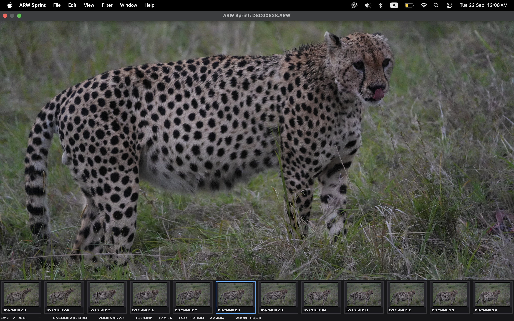

# ARW Sprint for Intel Mac

Pick your keepers from a folder full of Sony RAW photos.

ARW Sprint runs on **Intel Macs with Metal graphics**. It has been tested with
Sony A7 V `.ARW` files. Other Sony cameras and RAW modes remain unverified.
Windows and Apple Silicon Macs are not supported.



## Run the app

If you already have a build, double-click **ARW Sprint.app** in the project's
`dist` folder. Or run this in Terminal from the project folder:

```sh
open "dist/ARW Sprint.app"
```

Press **Cmd+O** and choose the folder containing your ARWs. You can also drop a
folder or ARW onto the app. It opens that folder only, without scanning subfolders.
If the app has not been built yet, follow the build instructions below.

## Cull a folder

Use the arrow keys to move through photos. Press **1 to 5** to assign stars, then
use the **Filter** menu to show a particular rating. For example, choose five
stars to review only your five-star photos. Choose **All photos** to see everything
again. Ratings are saved beside each photo in an XMP sidecar and survive restart.

Press **Space or X** to move the current photo and its XMP sidecar into a local
`_Rejected` folder, then advance. This does not permanently delete anything.
**Cmd+Z** restores a move during the same session. To review moved photos, choose
**File → Open _Rejected Folder**. **U or 0** clears a rating, but does not restore a file.

Press **Tab** to show the bottom filmstrip. Scroll over it to browse thumbnails
without changing the main photo, then click a thumbnail to open it.
Scroll over the main photo to zoom and drag to pan. Zoom and position carry over
to the next photo by default; **L** turns that behavior off or on.

Photos too dark to judge? Press **]** to brighten or **[** to darken the view,
in one-third-stop steps up to ±3 stops. **Backslash (\\)** resets it.
Brightness applies to every photo, comparison and thumbnail, and stays set after
restarting. It only changes the view, never your RAWs or XMP sidecars. It cannot
recover details that are missing from the embedded JPEG.

## All shortcuts

### Browse and cull

| Key | Action |
| --- | --- |
| Right Arrow | Next photo |
| Left Arrow / Shift+Space | Previous photo |
| Space / X | Move photo and sidecar to `_Rejected`, then advance |
| 1 to 5 | Assign stars |
| U / 0 | Clear rating or rejection metadata; does not restore moved files |
| Cmd+Z | Undo a rating edit or local move, up to 100 actions this session |
| A | Toggle auto-advance after assigning or clearing a rating |
| Cmd+Option+1 to 5 | Show only that exact star rating |
| Cmd+Option+0 | Show all photos |
| Cmd+Option+X | Show photos marked rejected in their XMP sidecars |
| Cmd+Delete | Confirm moving the current XMP-rejected photo to macOS Trash |
| Tab | Show / hide the filmstrip |
| Scroll over the filmstrip | Browse thumbnails without changing the main photo |
| Click a thumbnail | Open that photo |

The rejected filter checks saved metadata in the current folder. To see files
moved with Space or X, use **File → Open _Rejected Folder**. Trash actions leave
XMP sidecars in place and cannot be undone with Cmd+Z.

### View and app

| Key or gesture | Action |
| --- | --- |
| S / + / = | Zoom in |
| D / - / _ | Zoom out |
| Z | Switch between fit and 100% |
| L | Keep zoom and position across photos on / off |
| Hold P | Peek at 100% under the pointer; release to return |
| Mouse wheel / trackpad scroll over the photo | Zoom around the pointer |
| Trackpad pinch | Zoom around the pointer |
| Click and drag the photo | Pan while zoomed |
| ] / [ | Brighten / darken all previews by one-third stop |
| Backslash (\\) | Reset viewing brightness |
| C | Pin the current photo for comparison / close comparison |
| Shift+C | Replace the pinned reference with the current photo |
| F | Toggle fullscreen |
| Esc | Leave fullscreen; otherwise fit the photo to the window |
| Cmd+O | Open a folder |
| Cmd+Q | Save pending ratings and quit |
| Cmd+M | Minimize the window |
| Cmd+H | Hide ARW Sprint |
| Cmd+Option+H | Hide other applications |

In comparison, the reference is on the left and the current photo is on the
right. Browsing, ratings and file moves affect the right photo; zoom and pan are linked.

More menu actions:

- **View → Fit / Fill / Actual Size (100%)** selects a display mode directly.
- **Filter → Rated photos / Unrated photos / Not rejected** offers more filters.
- **File → Move Rejected Photos to _Rejected… / Move Rejected Photos to Trash…**
  confirms a batch move of photos with saved rejection metadata.
- **Help → Keyboard Shortcuts** opens the in-app reference.

## Build from source

You need Rust, Apple's Xcode Command Line Tools, and Homebrew installed on an
Intel Mac. Run these commands from the project folder:

```sh
brew install cmake nasm
rustup target add x86_64-apple-darwin
./scripts/package-macos.sh
# Quit any running copy before opening the new build.
open "dist/ARW Sprint.app"
```

The script creates a locally signed app in `dist`. It does not install the app
in Applications.

## What keeps browsing fast

- **Read the preview directly.** File metadata locates the largest embedded JPEG,
  so opening a photo reads its preview instead of the whole ARW.
- **Use Intel acceleration.** The JPEG decoder automatically uses instructions
  supported by your CPU, with compatible fallbacks for older Intel Macs.
- **Put your current photo first.** Loading and decoding happen on background
  workers. If you skip ahead quickly, the app follows your latest selection.
- **Keep nearby photos ready.** Prefetch follows your browsing direction and keeps
  nearby photos in memory, up to a fixed budget, so going back and forth avoids
  loading them again when possible.
- **Reuse Metal textures.** Zoom, pan, resize and viewing brightness reuse the
  uploaded image. Background uploads help keep the window responsive during transfers.
- **Cache the filmstrip.** Tiny embedded previews stay in a rolling cache.
  Scrolling loads missing cells without changing or reloading the main photo.
- **Sleep when idle.** Workers wait for work or available memory, and the window
  redraws when needed. A full cache does not make the app keep checking for space.

## Intel measurements, 21 September 2026

Measured on an **Intel Core i7-1068NG7, 4 cores, 32 GB RAM, Iris Plus graphics**.
We also checked browsing, zoom, and the filmstrip using a folder of
**433 Sony A7 V ARWs**, without changing the photos.

| Full-size JPEG decode | Median time |
| --- | --- |
| Intel acceleration enabled | 178.8 to 179.9 ms |
| Acceleration disabled for comparison | 377.8 to 381.6 ms |

This used six 7008×4672 previews, 18 decodes per process, and two runs with the
order reversed. Intel acceleration was about **2.1× faster**. These are decode
times; moving to a cached photo skips that step. Loading an uncached photo can
still take more than 100 ms.

See the [Intel audit](docs/intel-audit.md) for methods, limits, and graphics results.
More detail: [file moves and undo](docs/deleted-workflow.md),
[architecture](docs/architecture.md), and [earlier measurements](docs/measurements.md).
